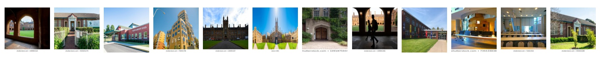
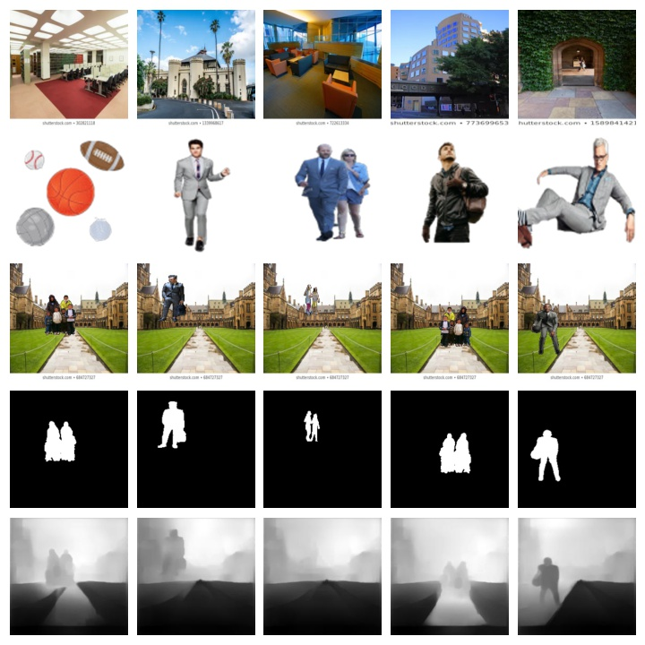
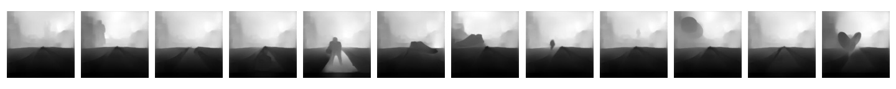
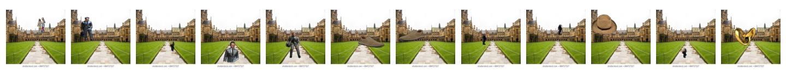
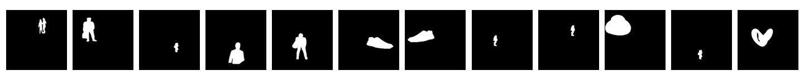
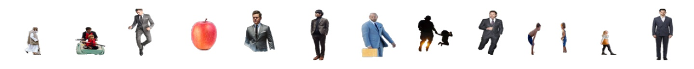

## Creating Dataset for Depth and Mask Prediction:

To create model for depth and mask , here we are trying to create a custom dataset using using 100 forground and 100 back ground images.
As collecting data from outside is tedious and time consuming , we have restricted ourself to existing model( to create depth images) and 
python codes to overlay FG and BG so as to come up with a comprehensive data set that can be taken as input to model.Details are as follow.
 
### List of Data set and usage:

A. 100 backgrounds images - I have choosen School premises as back ground images.< All credit goes to Google images >

B. 400k fg_bg images- By randomly placing the FG images on the back ground 20 * 2 times. I have created 400K images that will act as input to model
   < Check code Masking_Complete.ipynb for refrence >.

C. 400k depth images-As we have to collect Monocular depth images , I have used a existing model to extract the images. Input to the model is fg_bg images. I have nyu dataset for my prediction.
   400k mask images.
   ALl the credit goes to  [Depth](https://github.com/ialhashim/DenseDepth.git)
   
### How the data set are created :

A.    Back ground Images(BG) - Downloaded from internet < Resized to 224,224,3 >

B     Foregroung Images(FG) - Downloaded for internet 
   
   
   1.    Creating Transparent Foreground image(FG): There are multiple ways to achieve this, But i have choosen GIMP -
         It can be used as a simple paint program, an expert quality photo retouching program, an online batch processing system, a mass production image renderer, an image format converter, etc. 
         <Please go through this tutorial -(Trust me its easy) -https://thomas-cokelaer.info/blog/2016/09/gimp-how-to-make-a-transparent-background/
   

C.   Merging data set(FG_BG Creation) - Disclaimer <As i have to create 400K (FG_BG) , 400K (MAsk) , 400K Depth .Keep the Image size small and use Grey scale wheerever possible.>>>
     I have used Python code to accomplish this task. Please check <Masking_Complete.ipynb>
   

D.   Big Challenge - Size of the image was as following - BG_FG = 9.3GB , Mask - (241 MB) , BG = (2.1 MB)

     Big thanks to 7 ZIP compression tool , i am able to compress the data set tp appx (1.2GB)
  
  
E.  To create Depth images - Load the data set to Google colab. Do not unzip such large dataset on drive.<Strictly use colab drive>. It will definately crash the drive and 
    your account will be locked.
    
   My Code : [DenseDepth](https://github.com/sobti/TSAI/blob/master/S14-15/DenseDepth.ipynb)
 
  
   Download the Depth model from [Depth](https://github.com/ialhashim/DenseDepth.git)
  
    Model requires the images in the multiple of 32. I have used 480,480,3 . Reason for such large image is to create clear depth images .
    To reduce the size , i have changed the Images back to grayscale after predicton of size (224,224,1).
    
  ### sample images:
    
   1. [Back Ground Images](https://github.com/sobti/TSAI/blob/master/S14-15/Sample_Bg_Images.jpg)
     
      
     
  2. [Sample Dataset](https://github.com/sobti/TSAI/blob/master/S14-15/Sample_DataSet.jpg)
  
      
     
  3. [Sample Dense Depth](https://github.com/sobti/TSAI/blob/master/S14-15/Sample_FgBg_Dense_Images.jpg)
  
     
     
  4. [Sample FGBG](https://github.com/sobti/TSAI/blob/master/S14-15/Sample_FgBg_Images.jpg)
  
     
     
  5. [Sample Mask](https://github.com/sobti/TSAI/blob/master/S14-15/Sample_FgBg_Masks_Images.jpg)
  
     
     
  6. [Sample FG](https://github.com/sobti/TSAI/blob/master/S14-15/Sample_Fg_Images.jpg)
  
     
  
  
  ### Python Files
  
  1. [Stats](https://github.com/sobti/TSAI/blob/master/S14-15/stats.ipynb)
  2. [Exatract Images](https://github.com/sobti/TSAI/blob/master/S14-15/DatasetPreparation.ipynb)
  3. [Dense Depth Model](https://github.com/sobti/TSAI/blob/master/S14-15/DenseDepth.ipynb)
  
 ### Dataset Link
  Link: https://drive.google.com/drive/folders/14KJxztt8PFbwP_tzJThO_P19ZP5fT-yo?usp=sharing
  
  #### Size:
  
  Zip: 2.13G
  
  Unzip: 13G
  
  7z to zip the data
  
  7zip is the best compression to zip the data and load the data. The commands to zip and extract the data.

#### To zip the data
  !7z a outputfilename sourcetobezipped
#### To extract the data
!7z x sourcepath -o destpath

